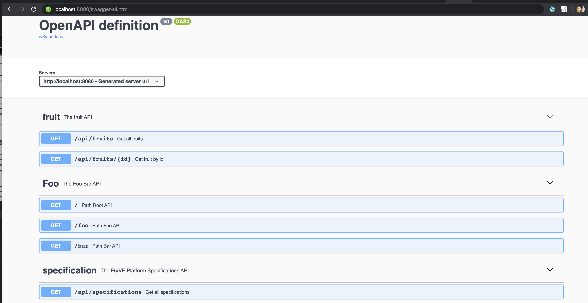

= What's this

A microservice demo.

== Backend Service

Access *http://HOSTNAME/swagger-ui.html* will get all backend service:

== Frontend Service

Thr Frontend Service will call Backend Service which will show results on UI.

== Deployments

Deploy the fruits services(both frontend and backend)

[source, bash]
----
// deploy to k8s
kubectl apply -f fruits.yaml

// deploy to istio
kubectl apply -f fruits-istio.yaml
kubectl apply -f fruits-istio-gateway.yaml
----

Access the *http://HOST/ui*, the request will go into frontend, and the frontend will call backend.

== Node.js Client

[source, bash]
.*Install Dependency*
----
cd client
npm install ws
----

[source, bash]
.*Test Entrypoint rlzy/ws*
----
$ node client.js ws://localhost:8010/rlzy/ws "Hello, World"
Connect to Server via  ws://localhost:8010/rlzy/ws
{"session": "93f23805-e023-7688-85a4-24da0f4762dd", "msg": "Hello, World", "date": "Sun May 23 00:16:15 CST 2021"}
----

[source, bash]
.*Test Entrypoint /rlzy/websocket*
----
$ node client.js ws://localhost:8010/rlzy/websocket "This Test Mssge From Kylin SONG"
Connect to Server via  ws://localhost:8010/rlzy/websocket
{"session": "c75b793e-340a-297b-3a75-93c587f7adfa", "msg": "This Test Mssge From Kylin SONG", "date": "Sun May 23 00:17:48 CST 2021"}
----

[source, bash]
.*Check the Spring Boot Server Log*
----
Connection Established: StandardWebSocketSession[id=93f23805-e023-7688-85a4-24da0f4762dd, uri=ws://localhost:8010/rlzy/ws]
93f23805-e023-7688-85a4-24da0f4762dd received: [Hello, World]
Connection Closed: StandardWebSocketSession[id=93f23805-e023-7688-85a4-24da0f4762dd, uri=ws://localhost:8010/rlzy/ws]

Connection Established: StandardWebSocketSession[id=c75b793e-340a-297b-3a75-93c587f7adfa, uri=ws://localhost:8010/rlzy/websocket]
c75b793e-340a-297b-3a75-93c587f7adfa received: [This Test Mssge From Kylin SONG]
Connection Closed: StandardWebSocketSession[id=c75b793e-340a-297b-3a75-93c587f7adfa, uri=ws://localhost:8010/rlzy/websocket]
----

